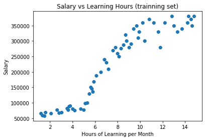

# Machine Learning - Linear Regression迴歸模型 - 強大的Sklearn - 簡單線性迴歸模型 、 多項式迴歸模型、多元迴歸模型 - 完整實作教學 


  嗨嗨大家，不知道大家有閱讀過我的上一篇[Machine Lesrning - 給自己的機器學習筆記 - Linear Regression - 迴歸模型介紹與原理]嗎，上一篇介紹了迴歸模型的原理與公式算法，這一篇主要是要教大家使用強大的Sklearn來實作迴歸模型喔，那我們開始吧！！


## 實作 


## 1. 數據集介紹 


這邊我捏造了一個非常有趣的數據集，這個數據集收集了不同人的學習時數與薪水，我想探討他們每個月願意花在學習上的時數與他們的月薪間的關聯，並訓練迴歸模型，就能用學習時數，來預測可能的薪水，簡單來說，就是只要有人告訴我，他每個月花在學習上的時數，我就能用這個訓練好的模型去預測他的薪水 提醒：這個數據集是我捏造的XD，大家千萬不要用這個數據集訓練出來的模型，來預測真實的狀況喔 


**數據集： linear_regression_dataset_sample**


## 2. Linear Regression 參數介紹


 這是接下來要使用來建構迴歸模型的函數，所以我們一起來瞭解一下這個函數中可用的參數吧 


```Python
LinearRegression(fit_intercept = True. normalize = False, copy_X = True, n_jobs = 1) 
```


+ fit_intercept: 預設為True，表示有將y軸的截距加入 ，並自動計算出最佳的截距值 ，如果為False，迴歸模型線會直接通過原點 

+ normalize : 是否將數據做歸一化（Normalize），預設為False

+ copy_X : 預設為True，表示X會被Copied，如果為False，X會被覆蓋掉

+　n_jobs : 計算模型所使使用的CPU數量，預設為1，如果傳入-1，就會使用全部的CPU


## 3. LinearRegression使用的方法


+ coef_ : 訓練完後，模型的係數，如果有多個目標值，也就是多個y值，就會回傳一個2Darray，裝載所有的係數值

+ intercept_ : 與y軸的截距值

+ predict : 預測數據 

+ score : 評估或準確度（Accuracy），它會利用R平方來判斷我們訓練出來模型的預測精準度，也就是預測的準確度  


## 4. 簡單線性迴歸 Simple Linear Regression


**公式:**  

```
y(x) = W0 + W1x
```


#### Step1 : 導入所需的套件 

```Python
## 導入所需的套件
## 導入Python數據處理套件
import numpy as np
import pandas as pd
## 導入視覺化套件
import matplotlib.pyplot as plt
## 導入Sklearn套件
## 導入將數據集拆成訓練集與測試集的套件
from sklearn.model_selection import train_test_split
## 導入迴歸模型套件
from sklearn.linear_model import LinearRegression
```


#### Step2 : 導入數據集，並取出自變數與應變數 


+　X : 將數據集中的"Learning_Hours"當特徵值（自變數）

+　y : 將數據集中的"Salary"當成目標值（依變數）

```Python
## 導入數據集
dataset = pd.read_csv("data/linear_regression_dataset_sample.csv")
X = dataset.iloc[:, 1].values.reshape(-1,1)
y = dataset.iloc[:,2].values
```


#### Step3 : 將數據集拆成訓練集與測試集

```Python
## 將數據集拆成訓練集與測試集
X_train, X_test, y_train, y_test = train_test_split(X, y, test_size = 0.3, random_state = 0)
```

**小提醒 ：如果大家想跟我拆成的訓練集與測試集一樣，那random_state（隨機種子）就要設為一樣的值喔** 


#### Step4 : 訓練迴歸模型 

```Python
## 訓練與建構迴歸模型
regressor = LinearRegression()
regressor.fit(X_train, y_train)
```


**這樣就完成訓練與建構模型囉，接下來我們來看看訓練好的模型有哪些用法**


#### Step5 : 找尋截距Interception與係數Coeficient值 執行結果 

```Python
## 計算出截距值與係數值
w_0 = regressor.intercept_
w_1 = regressor.coef_

print('Interception : ', w_0)
print('Coeficient : ', w_1)
```

**執行結果**

```
Interception :  5968.556965420779
Coeficient :  [26828.07518663]
```


#### Step6 : 瞭解迴歸模型對測試集資料的預測準確度 

+　score() : 它會利用R平方來判斷我們模型的精準程度，也就是預測的準確度 執行結果  

```Python
## 迴歸模型的準確度
score = regressor.score(X_test, y_test)
print('Score: ', score)
print('Accuracy: ' + str(score*100) + '%')
```

**執行結果**

```
Score:  0.8301578721256048
Accuracy: 83.01578721256048%
```


#### Step7 : 拿訓練好的迴歸模型來預測測試集資料的值 

+ 拿測試集中的X（自變數）來預測它的y值（依變數） 執行結果

```Python
## 拿訓練好的迴歸模型預測測試集資料的目標值(依變數)
y_pred = regressor.predict(X_test)
print('Predict : ', y_pred)
```

**執行結果**

```
Predict :  [242055.6186078  239372.81108914 279614.92386909 199130.69830919
 107915.24267463  46210.66974537 234007.19605181 306442.99905573
 164254.20056656 333271.07424236  62307.51485735 105232.43515597
 215227.54342117 268883.69379444 228641.58101449 271566.5013131
 252786.84868246  86452.78252532]
```


#### Step8 : 視覺化 

```Python
## 視覺化迴歸模型與訓練集的關聯
plt.scatter(X_train, y_train, color = 'red')
plt.plot(X_train, regressor.predict(X_train), color = 'blue')
plt.title('Salary vs Learning Hours (trainning set)')
plt.xlabel("Hours of Learning per Month")
plt.ylabel("Salary")
plt.show()


## 視覺化迴歸模型與測試集的關聯
plt.scatter(X_test, y_test, color = 'red')
plt.plot(X_test, regressor.predict(X_test), color = 'blue')
plt.title('Salary vs Learning Hours (test set)')
plt.xlabel("Hours of Learning per Month")
plt.ylabel("Salary")
plt.show()
```

**執行結果** 


**小回顧: 在第一篇教大家迴歸模型原理與公式詳解的時候，第一張圖跟這邊的一樣，那時候我有說要解釋為什麼數據點比較少，其實就是因為它是被總數據集拆出去的訓練集，數據量當然也會比較少一點**


**完整程式碼**

```Python
## 導入所需的套件
## 導入Python數據處理套件
import numpy as np
import pandas as pd
## 導入視覺化套件
import matplotlib.pyplot as plt
## 導入Sklearn套件
## 導入將數據集拆成訓練集與測試集的套件
from sklearn.model_selection import train_test_split
## 導入迴歸模型套件
from sklearn.linear_model import LinearRegression

## 導入數據集
dataset = pd.read_csv("data/linear_regression_dataset_sample.csv")
X = dataset.iloc[:, 1].values.reshape(-1,1)
y = dataset.iloc[:,2].values

## 將數據集拆成訓練集與測試集
X_train, X_test, y_train, y_test = train_test_split(X, y, test_size = 0.3, random_state = 0)

## 訓練與建構迴歸模型
regressor = LinearRegression()
regressor.fit(X_train, y_train)

## 計算出截距值與係數值
w_0 = regressor.intercept_
w_1 = regressor.coef_

print('Interception : ', w_0)
print('Coeficient : ', w_1)

## 迴歸模型的準確度
score = regressor.score(X_test, y_test)
print('Score: ', score)
print('Accuracy: ' + str(score*100) + '%')


## 拿訓練好的迴歸模型預測測試集資料的目標值(依變數)
y_pred = regressor.predict(X_test)

print('Predict : ', y_pred)

## 視覺化迴歸模型與訓練集的關聯
plt.scatter(X_train, y_train, color = 'red')
plt.plot(X_train, regressor.predict(X_train), color = 'blue')
plt.title('Salary vs Learning Hours (trainning set)')
plt.xlabel("Hours of Learning per Month")
plt.ylabel("Salary")
plt.show()


## 視覺化迴歸模型與測試集的關聯
plt.scatter(X_test, y_test, color = 'red')
plt.plot(X_test, regressor.predict(X_test), color = 'blue')
plt.title('Salary vs Learning Hours (test set)')
plt.xlabel("Hours of Learning per Month")
plt.ylabel("Salary")
plt.show()
```


## 5. 多項式迴歸 Polynomial Regression - Part 1


 **前言** 


從上面的結果可以看出，使用簡單線性迴歸（Simple linear Regression）模型來預測我們的數據集，並沒有預測的很好（Score不高），也就是它的迴歸模型線並沒有將數據集描述的很好，那接下來，我們就要使用多項式迴歸（Polynomial Regression）模型來針對我們的數據集進行預測  重點：  我們可以從視覺化結果看出簡單線性迴歸與多項式迴歸的差別，簡單線性迴歸只能訓練出一條直線，而多項式迴歸則可以是折線來貼和數據集 公式： y(x) = w0 + w1x + w2x2 + ... + wnxn 


**公式:**

```
y(x) = W0 + W1x+ W1x^2 + … + Wnx^n
```


#### Step1 : 導入所需的套件 

+ 這次多了PolynomialFeatures 與 make_pipeline套件來幫助我們實作出多項式迴歸（Polynomial Regression）模型 


```Python
## 導入所需的套件
## 導入Python數據處理套件
import numpy as np
import pandas as pd
## 導入視覺化套件
import matplotlib.pyplot as plt
## 導入Sklearn套件
## 導入將數據集拆成訓練集與測試集的套件
from sklearn.model_selection import train_test_split
## 導入迴歸模型套件
from sklearn.linear_model import LinearRegression
## 導入多項式套件，建構多項式迴歸模型所需的套件
from sklearn.preprocessing import PolynomialFeatures
from sklearn.pipeline import make_pipeline
```


#### Step2 : 導入數據集，並取出自變數與應變數


```Python
## 導入數據集
dataset = pd.read_csv("data/linear_regression_dataset_sample.csv")
X = dataset.iloc[:, 1].values.reshape(-1,1)
y = dataset.iloc[:,2].values
## 視覺化 數據集
plt.scatter(X, y)
plt.show()
```

**執行結果**




#### Step3 : 將數據集拆成訓練集與測試集

```Python
## 將數據集拆成訓練集與測試集
X_train, X_test, y_train, y_test = train_test_split(X, y, test_size = 0.3, random_state = 0)
```


#### Step4 : 利用訓練集資料訓練多項式迴歸（Polynomial Regression)模型 

+ 利用make_pipeline()來結多項式與迴歸方法，make_pipeline()的第一個參數放入PolynomialFeatures()，而PolynomialFeatures()裡面則放入所需的維度，也就是公式中的次方要到幾次方，像是我們放入4，PolynomialFeatures(4)就代表指定為四次多項式，第二參數放入迴歸模型，也可以放入像是Lasso()與Ridge()等等的

```Python
## 使用訓練集資料來訓練(擬和)迴歸模型
regressor = make_pipeline(PolynomialFeatures(6), LinearRegression())
regressor.fit(X_train, y_train)
```


**這樣就訓練好迴歸模型囉，接下來我們來看看訓練好的模型有哪些用法**  


#### Step5 : 瞭解迴歸模型對測試集資料的預測準確度 

+ score() : 它會利用R平方來判斷我們模型的精準程度，也就是預測的準確度 執行結果  

```Python
## 迴歸模型的準確度
score = regressor.score(X_test, y_test)
print('Score: ', score)
print('Accuracy: ' + str(score*100) + '%')
```

**執行結果**

```
Score:  0.9694916994802747
Accuracy: 96.94916994802747%
```


#### Step6 : 拿訓練好的迴歸模型來預測測試集資料的值 

+ 拿測試集中的X（自變數）來預測它的y值（依變數） 執行結果

```Python
## 拿訓練好的迴歸模型預測測試集資料的目標值(依變數)
y_pred = regressor.predict(X_test)
print('Predict : ', y_pred)
```

**執行結果**

```
Predict :  [306927.65361694 303950.67378419 327806.58075872 234670.42529062
  70119.30917105  73169.12938504 297337.45449394 328025.61899288
 153428.19417922 330311.16772202  79820.57460623  69253.27960456
 267467.89772396 325312.37232658 289849.60698869 326146.30697963
 316674.05566826  70597.71334969]
```


#### Step8 : 視覺化 

```Python
## 視覺化迴歸模型與訓練集的關聯
plt.scatter(X_train, y_train, color = 'red')
plt.plot(X_train, regressor.predict(X_train), color = 'blue')
plt.title('Salary vs Learning Hours (trainning set)')
plt.xlabel("Hours of Learning per Month")
plt.ylabel("Salary")
plt.show()


## 視覺化迴歸模型與測試集的關聯
plt.scatter(X_test, y_test, color = 'red')
plt.plot(X_test, regressor.predict(X_test), color = 'blue')
plt.title('Salary vs Learning Hours (test set)')
plt.xlabel("Hours of Learning per Month")
plt.ylabel("Salary")
plt.show()
```

**執行結果**


**完整程式碼**

```Python
## 導入所需的套件
## 導入Python數據處理套件
import numpy as np
import pandas as pd
## 導入視覺化套件
import matplotlib.pyplot as plt
## 導入Sklearn套件
## 導入將數據集拆成訓練集與測試集的套件
from sklearn.model_selection import train_test_split
## 導入迴歸模型套件
from sklearn.linear_model import LinearRegression
## 導入多項式套件，建構多項式迴歸模型所需的套件
from sklearn.preprocessing import PolynomialFeatures
from sklearn.pipeline import make_pipeline


## 導入數據集
dataset = pd.read_csv("data/linear_regression_dataset_sample.csv")
X = dataset.iloc[:, 1].values.reshape(-1,1)
y = dataset.iloc[:,2].values
## 視覺化 數據集
plt.scatter(X, y)
plt.title('Salary vs Learning Hours (trainning set)')
plt.xlabel("Hours of Learning per Month")
plt.ylabel("Salary")
plt.show()


## 將數據集拆成訓練集與測試集
X_train, X_test, y_train, y_test = train_test_split(X, y, test_size = 0.3, random_state = 0)

## 使用訓練集資料來訓練(擬和)迴歸模型
regressor = make_pipeline(PolynomialFeatures(6), LinearRegression())
regressor.fit(X_train, y_train)


## 迴歸模型的準確度
score = regressor.score(X_test, y_test)
print('Score: ', score)
print('Accuracy: ' + str(score*100) + '%')


## 拿訓練好的迴歸模型預測測試集資料的目標值(依變數)
y_pred = regressor.predict(X_test)

print('Predict : ', y_pred)

## 視覺化迴歸模型與訓練集的關聯
plt.scatter(X_train, y_train, color = 'red')
plt.plot(X_train, regressor.predict(X_train), color = 'blue')
plt.title('Salary vs Learning Hours (trainning set)')
plt.xlabel("Hours of Learning per Month")
plt.ylabel("Salary")
plt.show()


## 視覺化迴歸模型與測試集的關聯
plt.scatter(X_test, y_test, color = 'red')
plt.plot(X_test, regressor.predict(X_test), color = 'blue')
plt.title('Salary vs Learning Hours (test set)')
plt.xlabel("Hours of Learning per Month")
plt.ylabel("Salary")
plt.show()
```


**結論：大家可以很明顯發現使用多項式迴歸來預測我們數據集的準確度（Accuracy）明顯的提升了！！！！**  


## 6. 多項式迴歸 Polynomial Regression - Part2 


**前言** 

由於前面使用我的數據集訓練出來的多項式迴歸（Polynomial Regression）模型，所視覺化出來的圖有點難看懂XD，線沒有折的很清楚的感覺，所以我又另外的寫了一個程式範例來讓大家瞭解多項式迴歸模型的線，是怎麼擬和數據資料的 


**程式碼範例**

```Python
## 導入Python數據處理套件
import numpy as np
import pandas as pd
## 導入繪圖套件
import matplotlib.pyplot as plt
## 導入迴歸模型套件
from sklearn.linear_model import LinearRegression
## 導入多項式套件，建構多項式迴歸模型所需的套件
from sklearn.preprocessing import PolynomialFeatures
from sklearn.pipeline import make_pipeline
## 導入區分訓練集與測試集套件
from sklearn.model_selection import train_test_split

## 創建數據集
learning_hours = [1,2,7,8,18,26,28,32,35,37,39,41,44,50,58]
salary = [28000, 46000, 56000, 68000, 62000, 74000, 60000, 85000, 98000, 80000, 86000, 93000, 170000,200000, 280000]
plt.scatter(learning_hours, salary)
plt.title('Salary vs Learning Hours (test set)')
plt.xlabel("Hours of Learning per Month")
plt.ylabel("Salary")
plt.show()

## 組合成DataFrame格式
data_dict = {'Hours': learning_hours, 'Salary': salary}
df = pd.DataFrame(data_dict)
## X = pd.DataFrame(df.iloc[:,0])
## y = pd.DataFrame(df.iloc[:,1])
X = df[['Hours']]
y = df[['Salary']]

## 訓練多項式迴歸模型
regressor = make_pipeline(PolynomialFeatures(4), LinearRegression())
regressor.fit(X,y)

## 視覺化
plt.scatter(X,y)
plt.plot(X, regressor.predict(X), color = 'blue')
plt.title('Salary vs Learning Hours (test set)')
plt.xlabel("Hours of Learning per Month")
plt.ylabel("Salary")
plt.show()

```

**執行結果**


## 補充：7. 如何設定多項式迴歸模型要幾次方比較好？ 


+ 我只要加上一個迴圈去不斷訓練多項式迴歸模型，就能知道在不同次方的多項式迴歸模型中，誰的預測效果最好


**程式碼範例**

```Python
## 導入Python數據處理套件
import numpy as np
import pandas as pd
## 導入繪圖套件
import matplotlib.pyplot as plt
## 導入迴歸模型套件
from sklearn.linear_model import LinearRegression
## 導入多項式套件，建構多項式迴歸模型所需的套件
from sklearn.preprocessing import PolynomialFeatures
from sklearn.pipeline import make_pipeline
## 導入區分訓練集與測試集套件
from sklearn.model_selection import train_test_split

## 創建數據集
learning_hours = [1,2,7,8,18,26,28,32,35,37,39,41,44,50,58]
salary = [28000, 46000, 56000, 68000, 62000, 74000, 60000, 85000, 98000, 80000, 86000, 93000, 170000,200000, 280000]
plt.scatter(learning_hours, salary)
plt.title('Salary vs Learning Hours (test set)')
plt.xlabel("Hours of Learning per Month")
plt.ylabel("Salary")
plt.show()

## 組合成DataFrame格式
data_dict = {'Hours': learning_hours, 'Salary': salary}
df = pd.DataFrame(data_dict)
## X = pd.DataFrame(df.iloc[:,0])
## y = pd.DataFrame(df.iloc[:,1])
X = df[['Hours']]
y = df[['Salary']]


## 訓練不同次方多項式的迴歸模型

## 裝不同次方多項式的分數
scores = []
## 設定欲實驗的次方項與指定不同顏色
colors = ['gold', 'yellow', 'red', 'blue', 'purple', 'pink', 'black', 'orange']
polynomial_degree = [1,2,3,4,5,6,7,8]

for index, num in enumerate(polynomial_degree):
    
    ## 訓練多項式迴歸模型
    regressor = make_pipeline(PolynomialFeatures(num), LinearRegression())
    regressor.fit(X,y)
    ## 裝進精準度
    scores.append(regressor.score(X,y))
    ## 視覺化多項式迴歸模型線
    plt.plot(X, regressor.predict(X), color = colors[index], label = 'Polynomial Degree ' + str(polynomial_degree[index]))
    
## 繪製數據集資料點
plt.scatter(X,y)
plt.legend()
plt.show()
    
## 印出分數
for i in range(len(scores)):
    print('Polynomial Degree ' + str(i+1) + ' Score: ' + str(scores[i]))
```

**執行結果**


## 8. 多元迴歸 Multivariable Regression 


+ 多元迴歸模型用來處理當特徵值超過一個的時候，也就是當多個自變數（特徵）同時影響應變數（預測目標）的時候，所以下面的數據集中，除了原本的"learning_hours"與"salary"，我新增加了一個年資的特徵資料進入到數據集中 

  

**公式:**

```
y(x) = W_1 x_1 + W_2 x_2 + … + W_n x_n
```


+ 程式碼範例

```Python
## 導入Python數據處理套件
import numpy as np
import pandas as pd
## 導入繪圖套件
import matplotlib.pyplot as plt
## 導入迴歸模型套件
from sklearn.linear_model import LinearRegression
## 導入多項式套件，建構多項式迴歸模型所需的套件
from sklearn.preprocessing import PolynomialFeatures
from sklearn.pipeline import make_pipeline
## 導入區分訓練集與測試集套件
from sklearn.model_selection import train_test_split

## 創建數據集，多增加一個年資的特徵進入到數據集中
learning_hours = [1,2,7,8,18,26,28,32,35,37,39,41,44,50,58]
salary = [28000, 46000, 56000, 68000, 62000, 74000, 60000, 85000, 98000, 80000, 86000, 93000, 170000,200000, 280000]
years = [1,3,4,5,2,4,5,6,10,5,7,6,2,18,10]


## 組合成DataFrame格式
data_dict = {'Hours': learning_hours, 'Years': years, 'Salary': salary}
df = pd.DataFrame(data_dict)
## X = pd.DataFrame(df.iloc[:,0])
## y = pd.DataFrame(df.iloc[:,1])
X = df[['Hours','Years']]
y = df[['Salary']]


## 訓練多元迴歸模型
regressor = LinearRegression()
regressor.fit(X,y)

## 瞭解迴歸模型的精準度(準確度)
accuracy = regressor.score(X,y)
print('Score: ', accuracy)
print('Accuracy: ' + str(accuracy * 100) + '%')

## 拿訓練好的多元迴歸模型來預測數據集
y_pred = regressor.predict(X)
print('Predict: ')
print(y)
```

**執行結果**

```
Score:  0.6842196374201702
Accuracy: 68.42196374201703%
Predict: 
    Salary
0    28000
1    46000
2    56000
3    68000
4    62000
5    74000
6    60000
7    85000
8    98000
9    80000
10   86000
11   93000
12  170000
13  200000
14  280000
```


## 9. Lasso Regression(L1) & Ridge Regression(L2)     


避免過度擬和的方法 在上一篇對迴歸模型的原理介紹時，有講到兩個能夠降低過度擬和的方法 - Lasso Regression(L1) & Ridge Regression(L2)，在Sklearn的實作上非常方便，就是把我們前面用來建構迴歸模型的函數LinearRegression()改成Lasso()與Ridge()就好囉 


**解決的方法其實就是提供一個懲罰機制，來降低特徵數的使用量，以降低過度擬和的問題，這樣的方法稱為正規化**，如下兩個方法：  


#### Lasso() 與 Ridge() 參數介紹： 

+ alpha : 懲罰係數，預設為1，傳入的值越大，表示懲罰項越大，越能避免過度擬和，但太大的值會偏離真實的數據資料狀況 


#### 1.Lasso Regression(L1) 

+ LinearRegression()改成Lasso() 

.PNG)

```Python
## 訓練與建構迴歸模型
from sklearn.linear_model import Lasso
regressor = Lasso()
regressor.fit(X_train, y_train)
```


+ 完整程式碼

```Python
## 導入所需的套件
## 導入Python數據處理套件
import numpy as np
import pandas as pd
## 導入視覺化套件
import matplotlib.pyplot as plt
## 導入Sklearn套件
## 導入將數據集拆成訓練集與測試集的套件
from sklearn.model_selection import train_test_split
## 導入迴歸模型套件
from sklearn.linear_model import LinearRegression

## 導入數據集
dataset = pd.read_csv("data/linear_regression_dataset_sample.csv")
X = dataset.iloc[:, 1].values.reshape(-1,1)
y = dataset.iloc[:,2].values

## 將數據集拆成訓練集與測試集
X_train, X_test, y_train, y_test = train_test_split(X, y, test_size = 0.3, random_state = 0)

## 訓練與建構迴歸模型
from sklearn.linear_model import Lasso
regressor = Lasso()
regressor.fit(X_train, y_train)


## 計算出截距值與係數值
w_0 = regressor.intercept_
w_1 = regressor.coef_

print('Interception : ', w_0)
print('Coeficient : ', w_1)

## 迴歸模型的準確度
score = regressor.score(X_test, y_test)
print('Score: ', score)
print('Accuracy: ' + str(score*100) + '%')


## 拿訓練好的迴歸模型預測測試集資料的目標值(依變數)
y_pred = regressor.predict(X_test)

print('Predict : ', y_pred)

## 視覺化迴歸模型與訓練集的關聯
plt.scatter(X_train, y_train, color = 'red')
plt.plot(X_train, regressor.predict(X_train), color = 'blue')
plt.title('Salary vs Learning Hours (trainning set)')
plt.xlabel("Hours of Learning per Month")
plt.ylabel("Salary")
plt.show()


## 視覺化迴歸模型與測試集的關聯
plt.scatter(X_test, y_test, color = 'red')
plt.plot(X_test, regressor.predict(X_test), color = 'blue')
plt.title('Salary vs Learning Hours (test set)')
plt.xlabel("Hours of Learning per Month")
plt.ylabel("Salary")
plt.show()

```

**執行結果**

```
Interception :  5969.014421464875
Coeficient :  [26828.01718904]
Score:  0.8301573368137914
Accuracy: 83.01573368137915%
Predict :  [242055.565685   239372.76396609 279614.78974965 199130.73818254
 107915.47973981  46211.04020502 234007.16052829 306442.80693869
 164254.31583679 333270.82412773  62307.85051844 105232.6780209
 215227.54849596 268883.58287403 228641.55709048 271566.38459294
 252786.77256061  86453.06598858]
```


#### 2. Ridge Regression(L2) 

+ LinearRegression()改成Ridge() 

.PNG)

```Python
## 訓練與建構迴歸模型
from sklearn.linear_model import Ridge
regressor = Ridge()
regressor.fit(X_train, y_train)
```


+ 完整程式碼

```Python
## 導入所需的套件
## 導入Python數據處理套件
import numpy as np
import pandas as pd
## 導入視覺化套件
import matplotlib.pyplot as plt
## 導入Sklearn套件
## 導入將數據集拆成訓練集與測試集的套件
from sklearn.model_selection import train_test_split
## 導入迴歸模型套件
from sklearn.linear_model import LinearRegression

## 導入數據集
dataset = pd.read_csv("data/linear_regression_dataset_sample.csv")
X = dataset.iloc[:, 1].values.reshape(-1,1)
y = dataset.iloc[:,2].values

## 將數據集拆成訓練集與測試集
X_train, X_test, y_train, y_test = train_test_split(X, y, test_size = 0.3, random_state = 0)

## 訓練與建構迴歸模型
from sklearn.linear_model import Ridge
regressor = Ridge()
regressor.fit(X_train, y_train)


## 計算出截距值與係數值
w_0 = regressor.intercept_
w_1 = regressor.coef_

print('Interception : ', w_0)
print('Coeficient : ', w_1)

## 迴歸模型的準確度
score = regressor.score(X_test, y_test)
print('Score: ', score)
print('Accuracy: ' + str(score*100) + '%')


## 拿訓練好的迴歸模型預測測試集資料的目標值(依變數)
y_pred = regressor.predict(X_test)

print('Predict : ', y_pred)

## 視覺化迴歸模型與訓練集的關聯
plt.scatter(X_train, y_train, color = 'red')
plt.plot(X_train, regressor.predict(X_train), color = 'blue')
plt.title('Salary vs Learning Hours (trainning set)')
plt.xlabel("Hours of Learning per Month")
plt.ylabel("Salary")
plt.show()


## 視覺化迴歸模型與測試集的關聯
plt.scatter(X_test, y_test, color = 'red')
plt.plot(X_test, regressor.predict(X_test), color = 'blue')
plt.title('Salary vs Learning Hours (test set)')
plt.xlabel("Hours of Learning per Month")
plt.ylabel("Salary")
plt.show()
```

**執行結果**

```
Interception :  6274.9293725239695
Coeficient :  [26789.23240919]
Score:  0.8297980873601309
Accuracy: 82.9798087360131%
Predict :  [242020.17457338 239341.25133247 279525.09994625 199157.40271868
 108074.01252744  46458.77798631 233983.40485063 306314.33235544
 164331.40058674 333103.56476463  62532.31743182 105395.08928652
 215230.9421642  268809.40698257 228625.55836879 271488.33022349
 252735.86753706  86642.62660009]
```


#### 3. 應用於多項式的迴歸模型 


+ 以Lasso為例：LinearRegression()改成Lasso() 

```Python
## 訓練多項式迴歸模型
regressor = make_pipeline(PolynomialFeatures(4), Lasso())
regressor.fit(X,y)
```


+ 完整程式碼

```Python
## 導入Python數據處理套件
import numpy as np
import pandas as pd
## 導入繪圖套件
import matplotlib.pyplot as plt
## 導入迴歸模型套件
from sklearn.linear_model import LinearRegression
## 導入多項式套件，建構多項式迴歸模型所需的套件
from sklearn.preprocessing import PolynomialFeatures
from sklearn.pipeline import make_pipeline
## 導入區分訓練集與測試集套件
from sklearn.model_selection import train_test_split

## 創建數據集
learning_hours = [1,2,7,8,18,26,28,32,35,37,39,41,44,50,58]
salary = [28000, 46000, 56000, 68000, 62000, 74000, 60000, 85000, 98000, 80000, 86000, 93000, 170000,200000, 280000]
plt.scatter(learning_hours, salary)
plt.title('Salary vs Learning Hours (test set)')
plt.xlabel("Hours of Learning per Month")
plt.ylabel("Salary")
plt.show()

## 組合成DataFrame格式
data_dict = {'Hours': learning_hours, 'Salary': salary}
df = pd.DataFrame(data_dict)
## X = pd.DataFrame(df.iloc[:,0])
## y = pd.DataFrame(df.iloc[:,1])
X = df[['Hours']]
y = df[['Salary']]

## 訓練多項式迴歸模型
regressor = make_pipeline(PolynomialFeatures(4), Lasso())
regressor.fit(X,y)

## 視覺化
plt.scatter(X,y)
plt.plot(X, regressor.predict(X), color = 'blue')
plt.title('Salary vs Learning Hours (test set)')
plt.xlabel("Hours of Learning per Month")
plt.ylabel("Salary")
plt.show()
```


**執行結果**


## 10. 自行寫一個梯度下降（Gradient Decent）來實現迴歸模型預測 


**前言** 

前面的例子中都是直接使用強大的Sklearn裡的套件來實作迴歸模型，這邊我要分享大家一個不使用Sklearn套件，而是自行用程式來撰寫公式計算過程的方法 


**程式碼範例：實作迴歸模型**

```Python
## 參數
##學習率(Learning Rate): alpha值
alpha = 0.0001
## 訓練迴歸模型的迭代次數
trainning_repeats = 2000

## 初始化變數
## 截距與係數值 (Interception & Coeficient)
w0 = 0
w1 = 0
## 誤差 (實際值與預測值的誤差)
errors = []

## 訓練模型
for j in range(trainning_repeats):
    
    ## 最小平方值(誤差平方相加)
    squared_error_sum = 0
    
    ## 微分過後的成本函數(Cost Function)
    error_sum_x = 0
    error_sum = 0
    
    for i in range(len(X_train)):
        ## 預測公式: 簡單線性迴歸公式 y = w0 + w1x
        predict = w0 + (X_train[i] * w1)
        
        ## 最小平方法 計算成本函數(Cost Function), 或稱損失函數(Loss Function)
        squared_error_sum = squared_error_sum + (y_train - predict)**2
        
        ## 計算微分過後的成本函數(Cost Function)
        error_sum = error_sum + y_train[i] - predict
        error_sum_x = error_sum_x + (y_train[i] - predict) * X_train[i]
        
    ## 實現梯度下降(Gradient Descent)的方法
    ## 更新權重值 將原本的權重值 + 學習率 * 微分過後的成本函數(Cost Function)
    w0 = w0 + (alpha * error_sum)
    w1 = w1 + (alpha * error_sum_x)
    errors.append(squared_error_sum / len(X_train))
    
    
## 印出權重值
print('Interception: ', w0)
print('Coeficient: ', w1)
# print('每個數據點的誤差值: ', errors)

## 拿訓練好的模型來進行預測
predicts_y = []
mean_error = 0
for i in range(len(X_test)):
    
    ## 預測公式: 簡單線性迴歸公式 y = w0 + w1x
    predict = w0 + (X_test[i] * w1)
    predicts_y.append(predict)
```


**完整程式碼**


```Python
## 導入Python數據處理套件
import numpy as np
import pandas as pd


## 導入數據集
dataset = pd.read_csv("data/linear_regression_dataset_sample.csv")
X = dataset.iloc[:, 1].values.reshape(-1,1)
y = dataset.iloc[:,2].values

## 將數據集拆成訓練集與測試集
X_train, X_test, y_train, y_test = train_test_split(X, y, test_size = 0.3, random_state = 0)


## 參數
##學習率(Learning Rate): alpha值
alpha = 0.0001
## 訓練迴歸模型的迭代次數
trainning_repeats = 2000

## 初始化變數
## 截距與係數值 (Interception & Coeficient)
w0 = 0
w1 = 0
## 誤差 (實際值與預測值的誤差)
errors = []

## 訓練模型
for j in range(trainning_repeats):
    
    ## 最小平方值(誤差平方相加)
    squared_error_sum = 0
    
    ## 微分過後的成本函數(Cost Function)
    error_sum_x = 0
    error_sum = 0
    
    for i in range(len(X_train)):
        ## 預測公式: 簡單線性迴歸公式 y = w0 + w1x
        predict = w0 + (X_train[i] * w1)
        
        ## 最小平方法 計算成本函數(Cost Function), 或稱損失函數(Loss Function)
        squared_error_sum = squared_error_sum + (y_train - predict)**2
        
        ## 計算微分過後的成本函數(Cost Function)
        error_sum = error_sum + y_train[i] - predict
        error_sum_x = error_sum_x + (y_train[i] - predict) * X_train[i]
        
    ## 實現梯度下降(Gradient Descent)的方法
    ## 更新權重值 將原本的權重值 + 學習率 * 微分過後的成本函數(Cost Function)
    w0 = w0 + (alpha * error_sum)
    w1 = w1 + (alpha * error_sum_x)
    errors.append(squared_error_sum / len(X_train))
    
    
## 印出權重值
print('Interception: ', w0)
print('Coeficient: ', w1)
# print('每個數據點的誤差值: ', errors)

## 拿訓練好的模型來進行預測
predicts_y = []
mean_error = 0
for i in range(len(X_test)):
    
    ## 預測公式: 簡單線性迴歸公式 y = w0 + w1x
    predict = w0 + (X_test[i] * w1)
    predicts_y.append(predict)

    
## 視覺化
plt.scatter(X_test, y_test, color = 'red')
plt.plot(X_test, predicts_y, color = 'blue')
plt.title('Salary vs Learning Hours (test set)')
plt.xlabel("Hours of Learning per Month")
plt.ylabel("Salary")
plt.show()
```

**執行結果**


```
Interception:  [5383.65220318]
Coeficient:  [26886.29633745]
```


**大家可以調整學習率(Learning Rate)，也就是alpha值，與訓練迴歸模型的次數，也就是repeat值，來調整訓練出來的迴歸模型，傳入不同的值，預測效果也會跟著不同喔！！**


**Yeah~~有了第一篇文章對迴歸模型的觀念與原理理解，再來加上這篇學的實作能力，現在大家就可以拿拿手邊的數據集來訓練迴歸模型了，也能夠預測一些真實的情況了，機器學習超酷對吧，希望這篇有幫助到您～～**


## Reference


[https://pyecontech.com/2019/12/28/python-%E5%AF%A6%E4%BD%9C-%E8%BF%B4%E6%AD%B8%E6%A8%A1%E5%9E%8B/](https://pyecontech.com/2019/12/28/python-實作-迴歸模型/?fbclid=IwAR1UPgJwO_lcrjAScFUMYtqDJBvvRg9auR8X5Pt2eKNEufdnSpwskOvLxHo)

[https://sckit-learn.org/stable/modules/linear_model.html#](https://sckit-learn.org/stable/modules/linear_model.html?fbclid=IwAR1W0JM5sJro0ANSrKb_5APu3ZihKWHmsad8iOAUFFy0Ak-KKg43kdnRQgU)

[https://yltang.net/tutorial/dsml/13/](https://yltang.net/tutorial/dsml/13/?fbclid=IwAR0Rw5ITSgTITDAeY80q0QnKWzwm-VoQl27DmXXAMuwRyX_4hFe0hRsNYhY)

[https://kknews.cc/zh-tw/tech/4kkoqog.html](https://kknews.cc/zh-tw/tech/4kkoqog.html?fbclid=IwAR1VhDzocDYmaJS_zJfpJy4nmxx2vCR4cZg0Jue7R9F-yd38sy4r_Shdx1o)

[https://www.itread01.com/content/1546306589.html](https://www.itread01.com/content/1546306589.html?fbclid=IwAR3Xm8-HE4y5jC7ezG00t0B_a5Ru7n3LHF-0XaYjiT-fxuzErsyVp4J9NPw)

[https://ithelp.ithome.com.tw/articles/10187739](https://ithelp.ithome.com.tw/articles/10187739?fbclid=IwAR2xuzFlbcNAWproBrl_WTNuwgYkDDLSp3iptxLKYioCBaYIKOx2-pRcBo8)